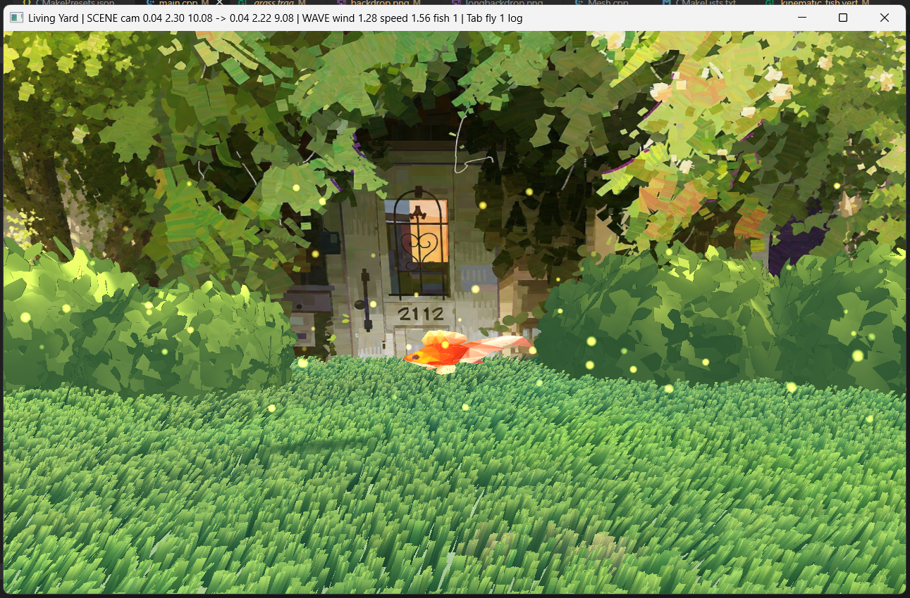
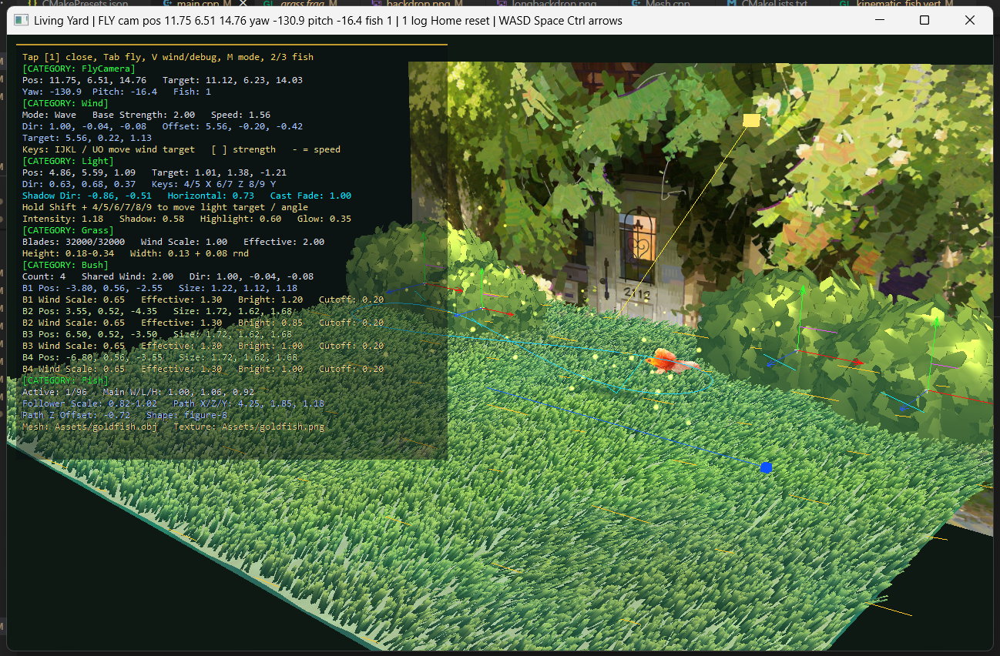

# Day-Dream-Garden

 

Day Dream Garden is a small **real-time OpenGL (C++) animation project** that creates a stylized living garden using procedural animation, shaders, and GPU-based rendering techniques.
This project was created as part of the **Advanced Computer Graphics** course, focusing on making a static environment feel alive through mathematics, procedural motion, and real-time rendering rather than relying on pre-made animations or full physics simulation.

## Overview

The scene is designed as a small fantasy garden filled with moving grass, bushes, floating goldfish, fireflies, and warm sunlight.
Most animation in the scene is generated procedurally in real time.
The wind system combines **sine waves and noise** to create moving regions of different wind strengths across the environment. Grass and bushes sample this wind field and react differently depending on their position and individual properties.
The grass field uses **instanced rendering** to efficiently draw a large number of blades from the same base geometry. Each blade has different parameters such as position, height, width, color, and flexibility.
Grass movement is then calculated directly in the vertex shader using **vertex deformation**, where the base of each blade stays almost fixed while the tip bends according to the current wind strength.
The goldfish uses a procedural **kinematic path** generated from sine and cosine functions instead of keyframe animation. Its body is also deformed in the vertex shader so that the tail moves more strongly than the head, creating a simple swimming motion.
Bushes are created from multiple **texture cards** placed at different angles and react to the same wind system with a slower response, giving them a heavier feeling compared with the grass.
Fireflies are rendered as small glowing **point sprites**, with their movement and brightness animated independently over time.

## Main Graphics Techniques
**Instanced Grass Rendering**

A single grass geometry is reused to render many grass blades through instanced rendering.
Each instance contains its own parameters such as:
- Position
- Height
- Width
- Color
- Flexibility
- Wind response
  
This allows the scene to contain a dense grass field without creating a separate mesh for every blade.

**Procedural Wind**

The wind system combines multiple sine waves with noise.
The sine waves create the main travelling motion of the wind while noise slowly changes its strength over time.
This creates areas where the wind becomes stronger or weaker and prevents the entire grass field from moving together as one synchronized block.

**Vertex Deformation**

Grass movement is calculated directly inside the vertex shader.
Vertices near the base of each grass blade move very little, while vertices closer to the tip receive stronger displacement.
The fish uses a similar technique, where vertices near the tail receive stronger oscillation than vertices near the head.

**Procedural Fish Animation**

The goldfish follows a curved kinematic path generated using sine and cosine functions.
Its current direction is calculated from nearby positions on the path so the fish can rotate toward the direction it is moving.
Body deformation is then added on top of the movement to create a simple swimming effect without using skeletal animation.

**Texture Card Vegetation**

Bushes are created using multiple transparent texture cards instead of modeling every leaf as individual geometry.
Several cards are placed at different angles to create the appearance of volume while keeping the geometry relatively simple.

**Fireflies**

Fireflies are implemented using small glowing point sprites.
Each firefly has its own movement phase and brightness phase so that they move and blink independently.

**Real-Time Animation**

Most animation systems share the same global scene time.
Movement is calculated using elapsed time rather than frame count, allowing animation speed to remain relatively consistent even when the frame rate changes.
Different phase offsets are also used so that grass blades, bushes, fish, and fireflies do not move in perfect synchronization.

## Fake Physics / Procedural Approximation

This project does not use a full physics simulation.
Instead, several behaviours are approximated mathematically to achieve a similar visual result while keeping the system lightweight and controllable.

For example:

- Wind is approximated using sine waves and noise instead of fluid simulation
- Grass bending uses vertex deformation instead of spring physics
- Grass does not use physical collision
- Fish movement uses a kinematic path instead of water simulation or AI
- Bush movement uses delayed procedural sway instead of physical joints

The goal is visual plausibility rather than physical accuracy.

## Technologies Used
- C++
- Modern OpenGL
- GLSL
- GLFW
- GLEW
- GLM
- CMake
- vcpkg

## Debugging

The project includes several debug tools to help inspect procedural systems while the scene is running.
Debug visualization can be used to inspect:
- Wind direction
- Wind behaviour
- Grass movement
- Fish position
- Fish movement path
- Fish facing direction
- Light direction
- Firefly distribution
- Camera behaviour

These tools were useful for separating problems between systems while tuning the final scene.

## Install & Quickstart

**1. Requirements**

Windows:
- Visual Studio 2022 with **Desktop development with C++**
- Git
- CMake
- VS Code

Recommended VS Code extensions:
- C/C++ (`ms-vscode.cpptools`)
- CMake Tools (`ms-vscode.cmake-tools`)

**2. Clone**
```bash
git clone https://github.com/sSODAs/Day-Dream-Garden.git
cd Day-Dream-Garden
```

**3. vcpkg**

If vcpkg is not installed yet:
```bash
git clone https://github.com/microsoft/vcpkg $env:USERPROFILE\vcpkg
& $env:USERPROFILE\vcpkg\bootstrap-vcpkg.bat
setx VCPKG_ROOT "$env:USERPROFILE\vcpkg"
```

**4. Configure**

The project includes a CMake preset for Windows:
```bash
cmake --preset win-msvc
```

**5. Build**
```bash
cmake --build build --config Debug
```

**6. Run**
```bash
.\build\Debug\AdvancedCGStarter.exe   
```
